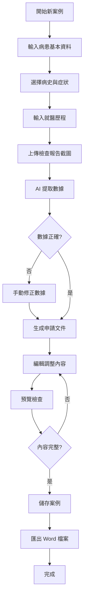

# TAVI 健保申請輔助系統 - 產品需求文件 (PRD)

> 由 `/concept` 維護

---

## 專案概述

### 專案目標

協助專科護理師快速完成 TAVI（經導管主動脈瓣膜置換術）健保事前審查申請文件，透過 AI 自動讀取檢查報告截圖並生成標準化申請文件，大幅減少資料整理時間。

### 核心價值

- **省時高效**：將原本需要數小時的資料整理工作，縮短至 15-30 分鐘
- **降低錯誤**：AI 自動提取數據，減少人工抄寫錯誤
- **標準化**：確保申請文件格式一致，符合健保局要求
- **易於使用**：考量使用者年齡，設計簡單直覺的操作介面

### 問題陳述

目前專科護理師處理 TAVI 健保申請時，需要：
1. 從醫院系統手動擷取各種檢查報告
2. 逐一閱讀 PDF 報告，手動抄寫關鍵數據
3. 整理病史、症狀、檢查結果成文字敘述
4. 按照健保局格式排版
5. 反覆檢查數據正確性

**耗時**：每個案例需 2-4 小時
**痛點**：重複性高、容易出錯、格式複雜

---

## 目標用戶

### 用戶畫像

**主要用戶：專科護理師**
- 年齡：45-60 歲
- 技術背景：熟悉醫院資訊系統，但對新科技接受度中等
- 工作環境：醫院診間或辦公室，使用桌上型電腦或筆記型電腦
- 工作特性：時間緊迫、工作量大、需要準確性

### 使用場景

**場景 1：新案例申請**
- 護理師接到醫師指示，需為病患準備 TAVI 申請
- 從醫院系統截取各項檢查報告
- 使用本系統上傳截圖，生成申請文件
- 審閱調整後匯出，提交給醫師確認

**場景 2：補件/修正**
- 健保局要求補充資料或修正內容
- 從歷史案例中找到該病患記錄
- 修改內容後重新匯出

**場景 3：參考舊案例**
- 遇到特殊狀況，想參考過去類似案例
- 搜尋歷史記錄，查看過去的寫法

---

## 功能需求

### 核心功能 (MVP)

#### 1. 病患基本資料輸入
- [ ] 姓名
- [ ] 病歷號
- [ ] 性別（男/女）
- [ ] 出生日期（自動計算年齡）
- [ ] 身分證號

#### 2. 病史選擇系統
- [ ] **常見病史 Checkbox**（可複選）：
  - Aortic stenosis（主動脈瓣膜狹窄）
  - Atrial fibrillation（心房顫動）
  - Hypertension（高血壓）
  - Type 2 diabetes mellitus（第二型糖尿病）
  - Hyperlipidemia（高血脂）
  - Coronary artery disease (CAD)（冠狀動脈疾病）
  - Chronic kidney disease (CKD)（慢性腎臟病）
  - Heart failure（心衰竭）
    - HFrEF (heart failure with reduced ejection fraction)
    - HFpEF (heart failure with preserved ejection fraction)
  - COPD（慢性阻塞性肺病）
- [ ] **其他病史**（自訂輸入框）

#### 3. 症狀選擇系統
- [ ] **常見症狀 Checkbox**（可複選）：
  - 呼吸喘 (dyspnea)
  - 頭暈 (dizziness)
  - 胸悶/胸痛 (chest discomfort/pain)
  - 血壓偏低 (hypotension)
  - 無法平躺 (orthopnea)
  - 疲倦無力 (weakness/fatigue)
  - 昏厥 (syncope)
  - 活動耐受力下降 (decreased exercise tolerance)
- [ ] **症狀發生時間**（輸入框，例如「近 3 個月」「今年 4 月開始」）
- [ ] **其他症狀**（自訂輸入）

#### 4. 就醫歷程輸入
- [ ] 原追蹤地點（例如「在診所追蹤」「在本院門診追蹤」）
- [ ] 症狀惡化時間和轉診原因（簡短描述）

#### 5. 檢查報告上傳與數據提取

**5.1 上傳介面**
- [ ] 支援截圖上傳（PNG, JPG, JPEG）
- [ ] 支援拖曳上傳
- [ ] 每份報告可上傳多張截圖
- [ ] 報告類型分類：
  - 心臟超音波檢查
  - 心導管檢查
  - EKG 心電圖
  - Chest X-ray
  - 肺功能檢查
  - 檢驗報告
  - STS Score
  - 其他

**5.2 檢查日期處理**
- [ ] AI 自動識別檢查日期並預填
- [ ] 顯示 AI 信心度指示
- [ ] 護理師可手動確認/修改

**5.3 自動數據提取**

AI 需提取以下關鍵數據：

**心臟超音波 (Echocardiography)**
- AVA (Aortic Valve Area)
- Vmax (Peak velocity)
- Peak PG (Peak pressure gradient)
- Mean PG (Mean pressure gradient)
- LVEF (Left ventricular ejection fraction)
- 其他瓣膜問題 (AR, MR, TR, PR)

**心導管 (Cardiac Catheterization)**
- Mean pressure gradient (AO-LV)
- AVA (calculated)
- Coronary artery disease 描述
- Hemodynamic 數據

**檢驗報告**
- GFR (Glomerular filtration rate)
- Creatinine
- 其他重要數值

**STS Score**
- Risk of Mortality (%)

**5.4 數據顯示與確認**
- [ ] 以表格方式顯示提取的數據
- [ ] 標示 AI 信心度（高/中/低）
- [ ] 護理師可手動修改數據
- [ ] 未提取到的數據可手動補充

#### 6. 手術風險評估
- [ ] **STS Score** 輸入/自動提取
- [ ] **二位心臟外科醫師姓名**（輸入框）
- [ ] 自動判斷是否符合「傳統手術風險高 (STS score > 10%)」

#### 7. 日常生活評估
- [ ] **單選**：
  - 可以自理
  - 在家人的協助下是可以自理的
  - 需要他人照護
- [ ] **存活機率評估**（預設「至少有一年以上之存活機率」，可修改）

#### 8. 自動生成申請文件
- [ ] 根據輸入資料和提取數據，自動生成「事前審查申請文件」
- [ ] 文件結構：
  ```
  1. 標題：TAVI 事前審查
  2. 病患基本資料摘要
  3. 病情發展敘述（時間序列整理）
  4. 各項檢查報告（含數據）
  5. 手術風險評估
  6. 日常生活評估
  7. 結論與申請理由
  ```

#### 9. 文件編輯功能
- [ ] **所見即所得編輯器**（WYSIWYG）
- [ ] 可編輯任何 AI 生成的內容
- [ ] 即時預覽最終格式

#### 10. 匯出功能
- [ ] 匯出成 **Word 檔案** (.docx)
- [ ] 保持格式一致性（字型、段落、標題）
- [ ] 檔名自動命名：`事前審查-[病患姓名][病歷號].docx`

#### 11. 歷史案例管理
- [ ] **儲存功能**：每個案例自動儲存
- [ ] **案例列表**：顯示所有歷史案例
  - 病患姓名
  - 病歷號
  - 申請日期
  - 狀態（草稿/已完成）
- [ ] **搜尋功能**：依姓名、病歷號搜尋
- [ ] **載入編輯**：點選案例可重新編輯
- [ ] **刪除功能**：刪除不需要的案例

---

### 次要功能

#### A. 進階搜尋與篩選
- [ ] 依日期範圍篩選
- [ ] 依病史篩選
- [ ] 依 STS Score 範圍篩選

#### B. 資料匯出
- [ ] 匯出 PDF 格式
- [ ] 批次匯出多個案例

#### C. 統計功能
- [ ] 顯示總申請案例數
- [ ] 常見病史統計
- [ ] 平均 STS Score

#### D. 範本管理（未來考慮）
- [ ] 儲存常用文字範本
- [ ] 不同情況的敘述範本庫
- [ ] 快速插入範本

---

### 未來考慮

- **多語言支援**：英文版申請文件
- **行動版**：平板/手機支援
- **協作功能**：多位護理師共同編輯
- **提醒功能**：追蹤申請進度、補件提醒
- **AI 學習**：根據歷史案例優化生成品質
- **OCR 優化**：支援更複雜的報告格式

---

## 使用流程

### 完整操作流程



### 預估操作時間

| 步驟 | 目前時間 | 系統輔助後 |
|------|---------|-----------|
| 收集資料 | 30 分鐘 | 10 分鐘（截圖） |
| 數據提取 | 40 分鐘 | 2 分鐘（AI 自動） |
| 文件撰寫 | 60 分鐘 | 5 分鐘（AI 生成） |
| 格式調整 | 20 分鐘 | 5 分鐘（自動格式化） |
| 檢查確認 | 20 分鐘 | 10 分鐘 |
| **總計** | **170 分鐘** | **32 分鐘** |

**效率提升：約 81%**

---

## 非功能需求

### 效能要求

- **AI 數據提取**：單張截圖處理時間 < 10 秒
- **文件生成**：完整申請文件生成時間 < 5 秒
- **頁面載入**：首次載入 < 3 秒
- **截圖上傳**：支援單檔最大 10MB

### 安全要求

- **資料儲存**：所有病患資料僅儲存在 Local Storage 或使用者的瀏覽器中
- **隱私保護**：
  - 不上傳完整截圖到外部伺服器（僅傳送必要數據給 Claude API）
  - Claude API 不保留數據（使用 Anthropic 的 zero data retention 政策）
- **資料備份**：提供匯出/匯入功能，讓用戶自行備份

### 相容性

- **瀏覽器**：
  - Chrome 100+（推薦）
  - Edge 100+
  - Firefox 100+
  - Safari 15+
- **作業系統**：Windows 10/11, macOS 12+
- **螢幕解析度**：最低 1366x768，推薦 1920x1080

### 可用性要求

- **簡單直覺**：60 歲使用者無需教學即可上手
- **錯誤提示**：清楚的中文錯誤訊息
- **操作指引**：每個步驟有簡短說明
- **鍵盤支援**：支援 Tab 鍵切換欄位

---

## 資料結構設計

### 案例資料格式 (JSON)

```json
{
  "caseId": "uuid",
  "createdAt": "2025-12-14T10:30:00Z",
  "updatedAt": "2025-12-14T11:00:00Z",
  "status": "completed",
  "patient": {
    "name": "林莊",
    "chartNumber": "12222823",
    "gender": "female",
    "birthDate": "1934-06-05",
    "nationalId": "E200332755"
  },
  "medicalHistory": [
    "Aortic stenosis",
    "Atrial fibrillation",
    "Hyperlipidemia",
    "HFpEF"
  ],
  "customHistory": "",
  "symptoms": [
    "dizziness"
  ],
  "customSymptoms": "",
  "symptomOnset": "近期",
  "clinicalCourse": {
    "previousCare": "在診所追蹤",
    "presentation": "至岡山醫院就醫，藥物使用後未改善"
  },
  "examinations": [
    {
      "type": "echocardiography",
      "date": "2025-06-04",
      "images": ["base64..."],
      "extractedData": {
        "AVA": "0.85",
        "Vmax": "4.35",
        "PeakPG": "75.6",
        "MeanPG": "45.1",
        "LVEF": "70.5"
      },
      "aiConfidence": 0.95
    },
    {
      "type": "catheterization",
      "date": "2025-07-14",
      "images": ["base64..."],
      "extractedData": {
        "AVA": "0.39",
        "MeanGradient": "52"
      },
      "aiConfidence": 0.92
    }
  ],
  "riskAssessment": {
    "stsScore": 12.5,
    "surgeon1": "謝炯昭",
    "surgeon2": "曾政哲"
  },
  "functionalStatus": "在家人的協助下是可以自理的",
  "prognosis": "至少有一年以上之存活機率",
  "generatedDocument": {
    "summary": "生成的文字內容...",
    "editedContent": "編輯後的內容..."
  }
}
```

---

## AI Prompt 設計原則

### 數據提取 Prompt

1. **明確指定**要提取的欄位（AVA, Vmax, etc.）
2. **提供醫學背景**：說明這是 TAVI 申請文件
3. **結構化輸出**：要求 JSON 格式回傳
4. **信心度評估**：要求 AI 標註每個數據的信心度

### 文件生成 Prompt

1. **提供範本**：使用真實案例作為範本
2. **醫學專業性**：要求使用正確的醫學術語
3. **時間序列**：按照檢查日期排序敘述
4. **格式一致性**：確保輸出格式符合健保局要求

---

## Subagent 設計

| Subagent | 職責 | 建立狀態 |
|----------|------|----------|
| `/frontend-dev` | 開發 Next.js 前端介面，包含表單、上傳、編輯器 | 待建立 |
| `/backend-dev` | 開發 API routes、整合 Claude API、處理圖片 | 待建立 |
| `/ai-engineer` | 設計和優化 AI prompt、調校數據提取準確度 | 待建立 |
| `/ui-designer` | 設計簡潔易用的 UI/UX，考量年長用戶需求 | 待建立 |
| `/tester` | 測試各項功能、驗證 AI 提取準確度 | 待建立 |

---

## 成功指標

### 量化指標

- **時間節省**：每個案例處理時間從 170 分鐘降至 30 分鐘
- **數據準確度**：AI 提取數據準確率 > 90%
- **使用率**：上線 3 個月內，80% 的案例使用本系統處理
- **錯誤率**：健保局退件率 < 5%

### 質化指標

- **使用者滿意度**：護理師反饋「比手動處理輕鬆」
- **易用性**：新手可在 10 分鐘內完成第一個案例
- **信賴度**：護理師信任 AI 提取的數據

---

## 風險評估

| 風險 | 影響 | 機率 | 應對策略 |
|------|------|------|----------|
| AI 數據提取不準確 | 高 | 中 | 人工確認機制、信心度顯示 |
| 報告格式多樣化 | 中 | 高 | 持續訓練 prompt、支援手動輸入 |
| 使用者學習曲線 | 中 | 中 | 提供教學影片、操作指引 |
| Claude API 成本 | 中 | 低 | 優化 prompt 長度、使用快取 |
| 資料隱私疑慮 | 高 | 低 | 明確說明資料處理方式 |

---

## 變更記錄

| 日期 | 版本 | 變更內容 |
|------|------|----------|
| 2025-12-14 | v0.1 | 初版建立，定義核心功能與流程 |
